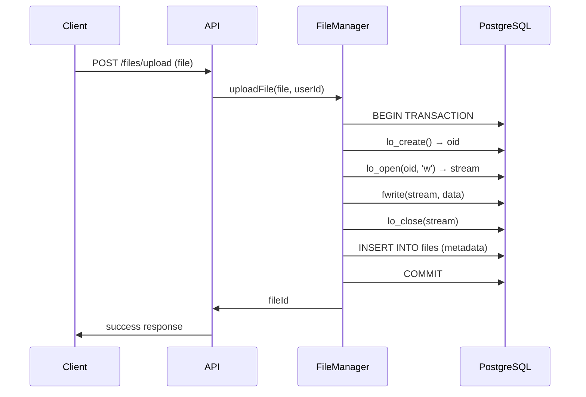
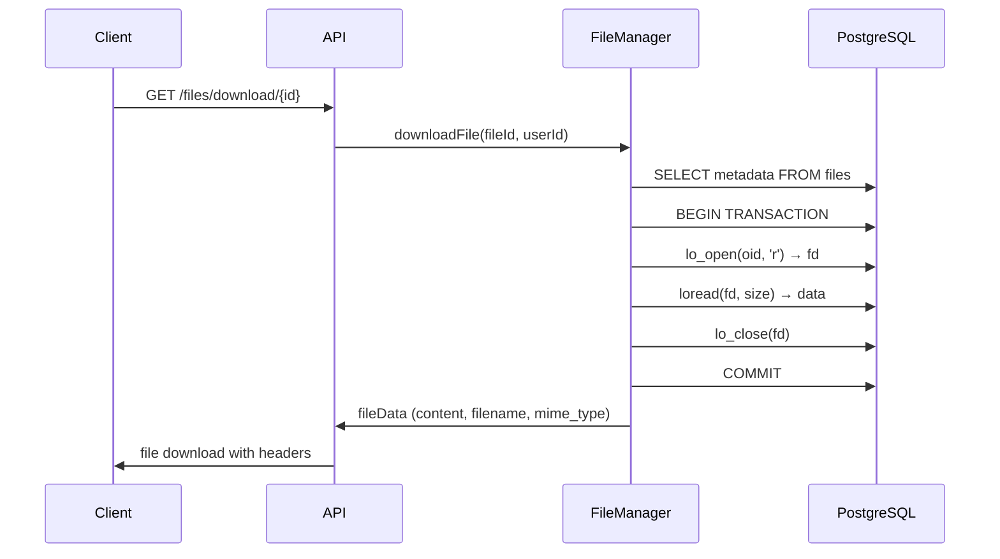

# Механизм хранения файлов в PostgreSQL

## Обзор

В данном проекте используется **PostgreSQL Large Objects (LO)** для хранения файлов в базе данных. Это позволяет хранить файлы любого размера непосредственно в PostgreSQL, обеспечивая целостность данных и транзакционную безопасность.

## Архитектура хранения

### Структура базы данных

```sql
-- Таблица для хранения метаданных файлов
CREATE TABLE files (
    id SERIAL PRIMARY KEY,
    user_id INTEGER REFERENCES users(id),
    filename VARCHAR(255),
    original_name VARCHAR(255),
    file_size BIGINT,
    mime_type VARCHAR(100),
    lo_oid OID,  -- Ссылка на Large Object
    is_public BOOLEAN DEFAULT FALSE,
    download_count INTEGER DEFAULT 0,
    created_at TIMESTAMP DEFAULT CURRENT_TIMESTAMP,
    updated_at TIMESTAMP DEFAULT CURRENT_TIMESTAMP
);
```

### Ключевые поля:
- **`lo_oid`** - уникальный идентификатор Large Object в PostgreSQL
- **`original_name`** - оригинальное имя файла
- **`file_size`** - размер файла в байтах
- **`mime_type`** - MIME-тип файла

## Процесс сохранения файла

### 1. API Endpoint
```php
POST /api/files/upload
Content-Type: multipart/form-data
Authorization: Bearer <token>

// FormData содержит:
// - file: загружаемый файл
```

### 2. Обработка в FileController
```php
public function uploadFile() {
    $payload = JWT::validateToken();
    
    if (!isset($_FILES['file'])) {
        Response::error('No file uploaded');
    }
    
    $file = $_FILES['file'];
    $userId = $payload['user_id'];
    
    // Сохраняем файл через FileManager
    $fileId = $this->fileManager->uploadFile($file, $userId);
    
    if ($fileId) {
        Response::success(['file_id' => $fileId], 'File uploaded successfully');
    } else {
        Response::error('Failed to upload file');
    }
}
```

### 3. Сохранение в FileManager
```php
public function uploadFile($file, $userId) {
    try {
        // Начинаем транзакцию
        $this->conn->beginTransaction();
        
        // Создаем Large Object
        $oid = $this->conn->pgsqlLOBCreate();
        
        // Открываем поток для записи
        $stream = $this->conn->pgsqlLOBOpen($oid, 'w');
        
        // Читаем загруженный файл по частям
        $fileHandle = fopen($file['tmp_name'], 'rb');
        while ($data = fread($fileHandle, 8192)) {
            fwrite($stream, $data);
        }
        fclose($fileHandle);
        fclose($stream);
        
        // Сохраняем метаданные в таблицу files
        $query = "INSERT INTO files 
                 (user_id, filename, original_name, file_size, mime_type, lo_oid) 
                 VALUES (:user_id, :filename, :original_name, :file_size, :mime_type, :lo_oid)";
        
        $stmt = $this->conn->prepare($query);
        $stmt->bindParam(":user_id", $userId);
        $stmt->bindParam(":filename", $file['name']);
        $stmt->bindParam(":original_name", $file['name']);
        $stmt->bindParam(":file_size", $file['size']);
        $stmt->bindParam(":mime_type", $file['type']);
        $stmt->bindParam(":lo_oid", $oid);
        
        if ($stmt->execute()) {
            $this->conn->commit();
            return $this->conn->lastInsertId();
        }
        
        $this->conn->rollBack();
        return false;
        
    } catch (Exception $e) {
        $this->conn->rollBack();
        throw $e;
    }
}
```

### 4. Диаграмма процесса сохранения



## Процесс выгрузки файла

### 1. API Endpoint
```php
GET /api/files/download/{fileId}
Authorization: Bearer <token>
```

### 2. Обработка в FileController
```php
public function downloadFile($fileId) {
    $payload = JWT::validateToken();
    
    if (!$payload) {
        Response::unauthorized('Invalid token');
    }
    
    // Получаем данные файла через FileManager
    $fileData = $this->fileManager->downloadFile($fileId, $payload['user_id']);
    
    if (!$fileData) {
        Response::notFound('File not found or access denied');
    }
    
    // Устанавливаем HTTP заголовки для скачивания
    header('Content-Type: ' . $fileData['mime_type']);
    header('Content-Disposition: attachment; filename="' . $fileData['filename'] . '"');
    header('Content-Length: ' . strlen($fileData['content']));
    
    // Выводим содержимое файла
    echo $fileData['content'];
    exit();
}
```

### 3. Выгрузка в FileManager
```php
public function downloadFile($fileId, $userId) {
    // Получаем метаданные файла
    $query = "SELECT * FROM files 
             WHERE id = :id AND (user_id = :user_id OR is_public = true)";
    
    $stmt = $this->conn->prepare($query);
    $stmt->bindParam(":id", $fileId);
    $stmt->bindParam(":user_id", $userId);
    $stmt->execute();
    
    $file = $stmt->fetch(PDO::FETCH_ASSOC);
    
    if ($file) {
        // Увеличиваем счетчик скачиваний
        $this->incrementDownloadCount($fileId);
        
        // Начинаем транзакцию для работы с Large Object
        $this->conn->beginTransaction();
        
        try {
            // Открываем Large Object для чтения
            $result = $this->conn->query("SELECT lo_open({$file['lo_oid']}, 262144) as fd");
            $fd = $result->fetch(PDO::FETCH_ASSOC)['fd'];
            
            if ($fd === false) {
                throw new Exception('Cannot open large object');
            }
            
            // Читаем содержимое по частям
            $content = '';
            $chunkSize = 8192;
            $totalSize = $file['file_size'];
            $readBytes = 0;
            
            while ($readBytes < $totalSize) {
                $bytesToRead = min($chunkSize, $totalSize - $readBytes);
                $result = $this->conn->query("SELECT loread($fd, $bytesToRead) as data");
                $row = $result->fetch(PDO::FETCH_ASSOC);
                $data = $row['data'];
                
                if ($data === false || $data === null || $data === '') {
                    break;
                }
                
                // Преобразуем resource в строку, если необходимо
                if (is_resource($data)) {
                    $data = stream_get_contents($data);
                }
                
                $content .= $data;
                $readBytes += strlen($data);
            }
            
            // Закрываем Large Object
            $this->conn->query("SELECT lo_close($fd)");
            
            // Подтверждаем транзакцию
            $this->conn->commit();
            
            return [
                'content' => $content,
                'filename' => $file['original_name'],
                'mime_type' => $file['mime_type']
            ];
            
        } catch (Exception $e) {
            // Откатываем транзакцию в случае ошибки
            $this->conn->rollback();
            throw $e;
        }
    }
    
    return false;
}
```

### 4. Диаграмма процесса выгрузки



## Преимущества использования PostgreSQL Large Objects

### 1. **Транзакционная безопасность**
- Файлы сохраняются в рамках транзакции
- При ошибке все изменения откатываются
- Гарантированная целостность данных

### 2. **Единая система хранения**
- Все данные (метаданные + файлы) в одной БД
- Упрощенное резервное копирование
- Нет необходимости в отдельной файловой системе

### 3. **Контроль доступа**
- Интеграция с системой пользователей
- Возможность настройки прав доступа
- Аудит скачиваний

### 4. **Масштабируемость**
- Поддержка файлов любого размера
- Эффективное использование памяти
- Чтение по частям (streaming)

## Ограничения и рекомендации

### Ограничения:
1. **Производительность**: Для очень больших файлов (>100MB) может быть медленнее файловой системы
2. **Память**: При чтении всего файла в память может возникнуть нехватка памяти
3. **Резервное копирование**: Полные бэкапы БД становятся больше

### Рекомендации:
1. **Размер файлов**: Оптимально до 50-100MB на файл
2. **Чтение по частям**: Всегда используйте streaming для больших файлов
3. **Мониторинг**: Отслеживайте размер БД и производительность
4. **Архивация**: Рассмотрите архивирование старых файлов

## Примеры использования

### Загрузка файла через curl:
```bash
curl -X POST http://localhost:8000/files/upload \
  -H "Authorization: Bearer YOUR_TOKEN" \
  -F "file=@/path/to/your/file.pdf"
```

### Скачивание файла через curl:
```bash
curl -H "Authorization: Bearer YOUR_TOKEN" \
  http://localhost:8000/files/download/123 \
  -o downloaded_file.pdf
```

### Получение списка файлов:
```bash
curl -H "Authorization: Bearer YOUR_TOKEN" \
  "http://localhost:8000/files?page=1&limit=10&sort_by=created_at&sort_order=DESC"
```

## Мониторинг и обслуживание

### Полезные SQL запросы:

```sql
-- Статистика по файлам
SELECT 
    COUNT(*) as total_files,
    SUM(file_size) as total_size,
    AVG(file_size) as avg_size,
    MAX(file_size) as max_size
FROM files;

-- Топ пользователей по объему файлов
SELECT 
    u.username,
    COUNT(f.id) as file_count,
    SUM(f.file_size) as total_size
FROM files f
JOIN users u ON f.user_id = u.id
GROUP BY u.id, u.username
ORDER BY total_size DESC;

-- Файлы без Large Objects (ошибки)
SELECT f.* FROM files f
LEFT JOIN pg_largeobject_metadata l ON f.lo_oid = l.oid
WHERE l.oid IS NULL;
```

### Очистка orphaned Large Objects:
```sql
-- Найти Large Objects без метаданных
SELECT oid FROM pg_largeobject_metadata 
WHERE oid NOT IN (SELECT lo_oid FROM files WHERE lo_oid IS NOT NULL);

-- Удалить orphaned Large Objects (ОСТОРОЖНО!)
-- DELETE FROM pg_largeobject WHERE loid IN (orphaned_oids);
```
