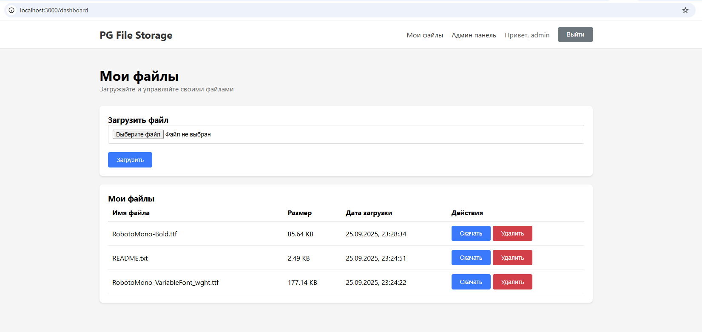
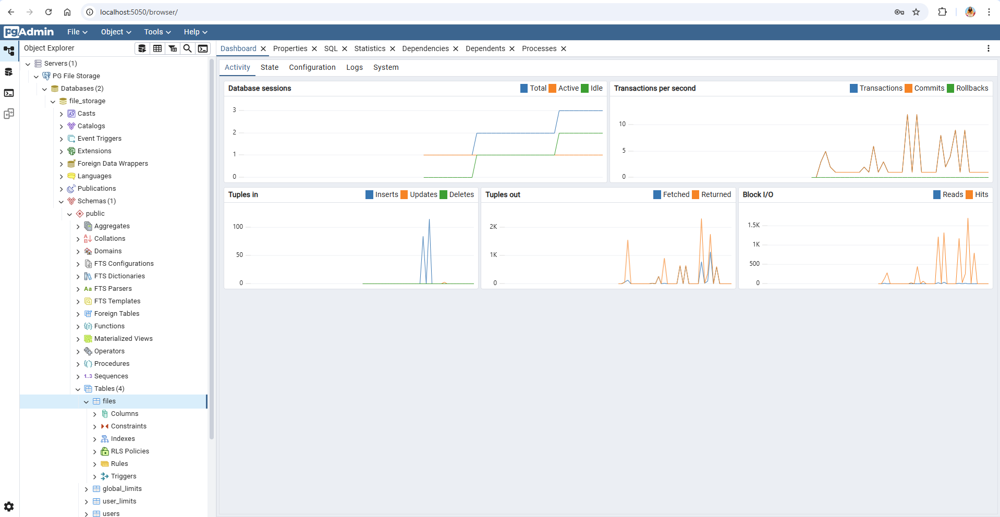

# PG File Storage - Система хранения файлов в PostgreSQL

Полнофункциональное веб-приложение для хранения и управления файлами с использованием PostgreSQL Large Objects.


## 🚀 Быстрый старт

### Запуск системы
```bash
docker-compose up -d
```

### Доступ к приложению
- **Frontend:** http://localhost:3000
- **API:** http://localhost:8000
- **pgAdmin:** http://localhost:5050

### Данные для входа
- **pgAdmin:** admin@example.com / admin
- **База данных:** admin / password
- **Приложение:** admin / password (по умолчанию)


## 📋 Компоненты системы

| Компонент | Порт | Описание |
|-----------|------|----------|
| Frontend (React) | 3000 | Веб-интерфейс приложения |
| API (PHP) | 8000 | REST API для управления файлами |
| PostgreSQL | 5432 | База данных с Large Objects |
| pgAdmin | 5050 | Веб-интерфейс для управления БД |

## 📚 Документация

- [Настройка pgAdmin](PGADMIN_SETUP.md) - Подробная инструкция по работе с базой данных
- [API Documentation](api/README.md) - Документация по REST API
- [Frontend Documentation](frontend/README.md) - Документация по React приложению

---

# Хранение больших объектов (Large Objects — LOB) в PostgreSQL
Анализ подходов.  
Разберём способы, их реализацию в связке с PHP/Yii2, а также готовые решения для самостоятельного развертывания.

### Краткое сравнение способов

| Способ | Плюсы | Минусы | Когда использовать |
| :--- | :--- | :--- | :--- |
| **Тип `bytea`** | Простота, работает "из коробки", совместим со всеми инструментами | Ограничение ~1 ГБ, весь объект в памяти, нет потоковой передачи | Небольшие файлы (до десятков МБ): картинки, документы, PDF |
| **Large Objects (LOB)** | Поддержка потоковой передачи, работа с файлами > 1 ГБ | Сложнее API, требуют управления внутри транзакций | **Большие файлы,** которые нужно читать/писать частями: видео, большие архивы, образы дисков |
| **Хранение пути в БД** | Максимальная производительность, простота, легко кешировать | Потеря гарантий целостности (Файл можно удалить вручную) | **Чаще встречающаяся практика.** Файлы на диске/NFS, а в БД — только метаданные и путь |

---

### 1. Тип `bytea` — Простое хранение "в строке"

Это самый простой способ. Вы сохраняете содержимое файла как двоичную строку прямо в колонке таблицы.

**Реализация в PHP/Yii2:**

```php
// 1. Миграция в Yii2 для создания таблицы
public function safeUp()
{
    $this->createTable('documents', [
        'id' => $this->primaryKey(),
        'name' => $this->string()->notNull(),
        'mime_type' => $this->string(),
        'content' => $this->binary(), // Для небольших файлов
        // 'content' => $this->db->schema->createColumnSchemaBuilder('longblob'), // Если нужен очень большой размер
        'created_at' => $this->timestamp(),
    ]);
}

// 2. Модель Document
class Document extends \yii\db\ActiveRecord
{
    // ...
}

// 3. Запись файла в БД (в Controller)
$filePath = '/path/to/your/file.zip';
$fileContent = file_get_contents($filePath);

$document = new Document();
$document->name = 'my_file.zip';
$document->mime_type = 'application/zip';
$document->content = $fileContent; // Данные просто сохраняются как строка

if ($document->save()) {
    // Успех!
}

// 4. Чтение и отправка файла клиенту (в Controller)
$document = Document::findOne($id);

// Важно: для больших файлов это может съесть всю память!
Yii::$app->response->sendContentAsFile(
    $document->content, 
    $document->name, 
    ['mimeType' => $document->mime_type]
);
return;
```

---

### 2. Нативные Large Objects (продвинутый способ)

PostgreSQL имеет специальный механизм `Large Objects`, который использует специальную таблицу `pg_largeobject` и работает с файлами через OID (Object Identifier). Ключевая особенность — **потоковая передача (streaming)** данных без полной загрузки в память PHP.

**Реализация с помощью `pgsql` функций PHP:**

```php
// Установите соединение, НЕ используя PDO, чтобы получить ресурс соединения.
$conn = pg_connect("host=localhost dbname=test user=postgres");
pg_query($conn, "BEGIN"); // Важно: работа с LOB всегда в транзакции!

// 1. Создание нового LOB и получение его OID
$oid = pg_lo_create($conn);
if (!$oid) { die("Cannot create large object"); }

// 2. Открытие объекта на запись
$lob = pg_lo_open($conn, $oid, 'w');
if (!$lob) { die("Cannot open large object"); }

// 3. ПОТОКОВАЯ запись данных из файла
$fileHandle = fopen('/path/to/huge/video.mov', 'r');
while ($data = fread($fileHandle, 4096)) { // Читаем по кусочкам
    pg_lo_write($lob, $data);
}
fclose($fileHandle);

// 4. Закрытие LOB и завершение транзакции
pg_lo_close($lob);
pg_query($conn, "COMMIT");

// 5. Теперь сохраните этот $oid в вашей таблице в колонке типа OID
$query = "INSERT INTO documents (name, file_oid) VALUES ('video.mov', $oid)";
pg_query($conn, $query);

// ЧТЕНИЕ и отдача файла потоком:
$document = // ... получили запись из БД, в которой есть OID
$oid = $document->file_oid;

header('Content-Type: application/octet-stream');
header('Content-Disposition: attachment; filename="video.mov"');

pg_query($conn, "BEGIN");
$lob = pg_lo_open($conn, $oid, 'r');
while ($data = pg_lo_read($lob, 4096)) { // Читаем по кусочкам и сразу отправляем
    echo $data;
    flush(); // Важно: сбрасываем буфер вывода
}
pg_lo_close($lob);
pg_query($conn, "COMMIT");
```

**Реализация в Yii2 (используя низкоуровневый `Command`):**

Yii2 поверх PDO, а у PDO нет прямого доступа к LOB-функциям PostgreSQL. Поэтому для работы с `pg_lo_*` функциями нужно получить низкоуровневый ресурс соединения.

```php
// Внутри своего компонента или сервиса
$db = Yii::$app->db;
$pdo = $db->pdo;

// Получаем native PDO connection resource (доступно не во всех сборках PHP)
// Чаще проще вынести работу с LOB в отдельную процедуру на стороне БД или использовать другой способ.
```

**Из-за этой сложности часто предпочитают первый или третий способ.**

---

### 3. Готовые решения и модули для Yii2

#### a) `moonlandsoft/yii2-upload`

Популярный модуль, который абстрагирует работу с загрузкой файлов. Обычно он использует **третий способ** (хранение пути в файловой системе), что является наиболее правильным и производительным решением в 95% случаев.

**Пример настройки:**
1. Установка: `composer require moonlandsoft/yii2-upload`
2. В конфиге:
```php
'modules' => [
    'upload' => [
        'class' => 'moonland\upload\Upload',
        'root' => '@webroot/uploads', // Куда сохранять файлы
        'baseUrl' => '@web/uploads',   // Base URL для доступа
    ],
],
```
3. В модели:
```php
use moonland\upload\UploadBehavior;

public function behaviors()
{
    return [
        [
            'class' => UploadBehavior::class,
            'attributes' => [
                'file_path' => [ // атрибут модели, куда запишется путь
                    'path' => '@webroot/uploads/files',
                    'tempPath' => '@webroot/uploads/tmp',
                    'baseUrl' => '@web/uploads/files',
                ],
            ],
        ],
    ];
}
```
Модуль сам обработает загрузку от пользователя, сохранит файл на диск и запишет путь в указанный атрибут вашей модели.

#### b) Собственное решение на основе поведения (Behavior)

Часто пишут свой кастомный `FileBehavior`, который делает то же самое: handling загрузки через форму, сохранение на диск, генерацию уникального имени, удаление старого файла и т.д. В БД при этом хранится только путь (`varchar`) или даже часть пути, если корень известен.

**Псевдокод своего Behavior:**
```php
class FileBehavior extends Behavior
{
    public $attributeName = 'file';

    public function events()
    {
        return [
            ActiveRecord::EVENT_BEFORE_VALIDATE => 'beforeValidate',
            ActiveRecord::EVENT_BEFORE_INSERT => 'beforeSave',
            ActiveRecord::EVENT_BEFORE_UPDATE => 'beforeSave',
            ActiveRecord::EVENT_AFTER_DELETE => 'afterDelete',
        ];
    }

    public function beforeValidate($event) { /* Проверка файла */ }
    public function beforeSave($event) {
        // Загрузка файла, генерация имени, сохранение на диск
        // Запись имени файла в атрибут модели
        $this->owner->file_path = $this->saveFile();
    }
    public function afterDelete($event) { /* Удаление файла с диска */ }
}
```

### Итог и рекомендация

1.  **Для маленьких файлов (до ~20-50 МБ)** используйте **`bytea`**. Это просто и надежно.
2.  **Для больших файлов (видео, архивы гигабайтного размера)**, если вы *обязаны* хранить их в БД, используйте **нативные Large Objects** с потоковой передачей. Будьте готовы к сложности и используйте прямое подключение `pg_*`.
3.  **В подавляющем большинстве случаев** **лучшей практикой является комбинация "Файл на диске + путь в БД"**. Это реализуют все готовые модули (вроде `moonlandsoft/yii2-upload`) или кастомные поведения. Это дает максимальную производительность, простоту резервного копирования (файлы и БД отдельно) и легкость масштабирования (можно использовать NFS или объектное хранилище).